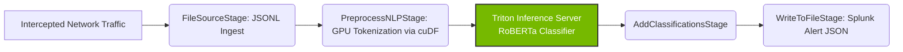

# 🛡️ Morpheus LLM Defender (GPU-Accelerated Prompt Injection Detection)

> **Objective:** Detect and alert on LLM Prompt Injection attacks embedded in corporate network traffic in real-time using NVIDIA Morpheus and GPU-accelerated machine learning (cuDF / Triton).

## Why This Matters
As enterprises rapidly adopt "Agentic AI" and LLM APIs, developers often send highly sensitive prompts to models like GPT-4 or Claude. Attackers use **Prompt Injection** ("Ignore previous instructions...") to hijack these agents, steal data, or manipulate output. Traditional SIEMs and regex-based rules cannot detect semantic injections in real-time. 

This project leverages **NVIDIA Morpheus** to intercept network payloads, preprocess the text entirely on the GPU, and run an inference classification model to flag injections instantly.

## 🏗️ Architecture



## 💻 Hardware Compatibility
This pipeline was specifically designed to run on **Prosumer Hardware**.
- **GPU Required:** NVIDIA RTX 3060 (12GB VRAM) or better.
- **Why it fits:** The Triton Server hosting a quantized prompt injection model uses `< 2GB VRAM`. The Morpheus cuDF pipeline consumes `< 3GB VRAM`. The entire stack runs comfortably inside a 12GB footprint, leaving room for host OS operations and local labs.

## 🚀 Setup & Execution (WSL2 / Linux)

### Prerequisites
1. Windows 11 with **WSL2** installed.
2. Docker Desktop configured with **WSL2 integration** and **NVIDIA Container Toolkit** enabled.

### Running the Pipeline
1. Clone this repository into your WSL2 environment.
2. *Note: You must download a pre-trained ONNX prompt injection model and place it in the `models/prompt-injection-detector/1/` directory. (Instructions on fine-tuning a RoBERTa model coming soon).*
3. Boot the environment:
   ```bash
   docker-compose up -d
   ```
4. View the output alerts:
   ```bash
   cat data/alerts_output.jsonlines
   ```

## 💼 Skills Demonstrated
- **GPU-Accelerated Data Engineering:** Using `cuDF` and RAPIDS to bypass CPU bottlenecks.
- **Machine Learning Operations (MLOps):** Deploying the NVIDIA Triton Inference Server.
- **AI Security:** Implementing behavioral, semantic detection for LLM vulnerabilities (Prompt Injection, Jailbreaks).
- **Docker Compose Orchestration:** Managing multi-container GPU workloads.