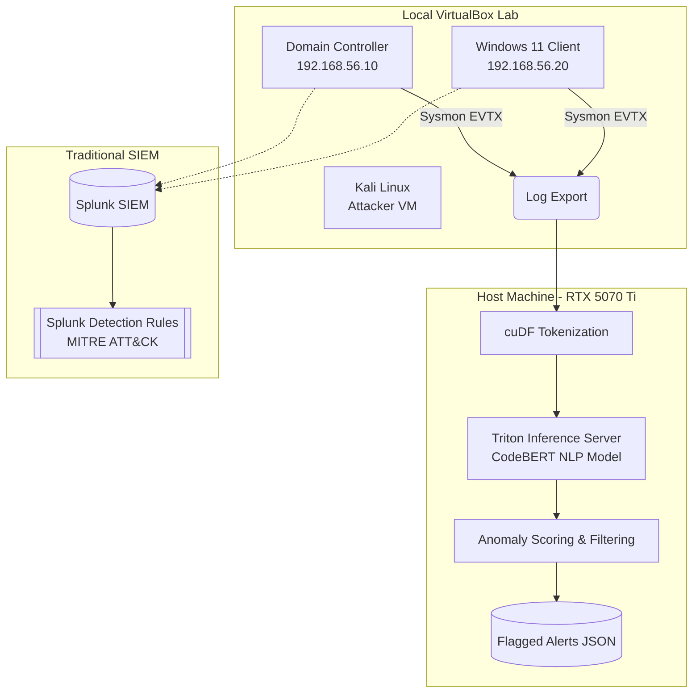

# Randall's Cybersecurity Portfolio

> **Objective:** Transitioning into a Cybersecurity/SOC Analyst role, leveraging a background in automation, software development, and AI to build robust defense mechanisms and streamline incident response.

This repository serves as a functional portfolio demonstrating practical, hands-on skills across core domains of cybersecurity: AI-Driven Detection Engineering, Infrastructure-as-Code (IaC), and Incident Response (IR).

Rather than relying purely on theoretical knowledge, the tools and configurations in this repository were built to solve real-world problems by combining custom-built Active Directory home lab environments with GPU-accelerated Machine Learning frameworks (NVIDIA Morpheus).

---

## 🏗️ Portfolio Architecture

The following Mermaid diagram outlines the interconnected nature of the tools within this portfolio. A local Active Directory lab feeds telemetry into an offline AI threat-hunting pipeline for GPU-accelerated NLP analysis.

---

## 🛠️ Projects & Skills Demonstrated

### 1. [Morpheus Sysmon NLP Hunter](./Morpheus-Sysmon-Hunter) (🌟 Featured)
A GPU-accelerated threat-hunting pipeline using NVIDIA Morpheus. It ingests Windows Sysmon logs and uses a CodeBERT Natural Language Processing (NLP) model to identify anomalous execution patterns, PowerShell obfuscation, and lateral movement, bypassing traditional regex limitations.
* **Skills Demonstrated:** 
  * AI Security & Machine Learning Operations (MLOps)
  * GPU-Accelerated Data Engineering (cuDF, Triton)
  * Sysmon Event Analysis (Event ID 1 & 4104)

### 2. [Active Directory Lab Automation](./AD-Lab-Automation)
PowerShell scripts designed to rapidly deploy a Windows Server 2022 AD environment, configure GPOs, populate users/OUs, and install Sysmon and Splunk Universal Forwarders. These logs feed directly into the Sysmon NLP Hunter.
* **Skills Demonstrated:** 
  * Infrastructure-as-Code (IaC)
  * Active Directory Administration (OUs, GPOs, Users)
  * Endpoint Telemetry (Sysmon SwiftOnSecurity config)

### 3. [Morpheus LLM Defender](./Morpheus-LLM-Defender)
Detects and alerts on LLM Prompt Injection attacks embedded in corporate network traffic in real-time using GPU-accelerated machine learning.
* **Skills Demonstrated:** 
  * AI Vulnerability Detection (Prompt Injection)
  * High-speed payload interception

### 4. [Splunk Detection Rules](./Splunk-Detection-Rules)
A library of Search Processing Language (SPL) queries mapped to MITRE ATT&CK, designed to detect common post-exploitation activities via Sysmon and Windows Event Logs.
* **Skills Demonstrated:** 
  * Detection Engineering
  * SIEM Querying (Splunk SPL)
  * MITRE ATT&CK Framework mapping

---

## 🚀 Secondary & Archived Projects

* **[Morpheus PCAP Analyzer](./Morpheus-PCAP-Analyzer):** Offline network packet analysis using cuDF for CTFs.
* **[Morpheus DGA Detector](./Morpheus-DGA-Detector):** Pi-Hole DNS integration for finding Command & Control beacons.
* **[Morpheus-Lite Starter Kit](./Morpheus-Lite):** Template for running enterprise Morpheus on a 16GB consumer GPU via WSL2.
* **[Archived Projects](./Archived):** Older SOC automation tools including a Phishing Email Analyzer and a Web3 Crypto Incident Response tool.

---

## 🚀 Usage & Setup
Each sub-directory contains its own `README.md` with specific installation instructions, prerequisites, and execution commands. 

*Note: All API keys must be provided locally via `.env` files. Reference the provided `.env.example` files in each project directory.*
