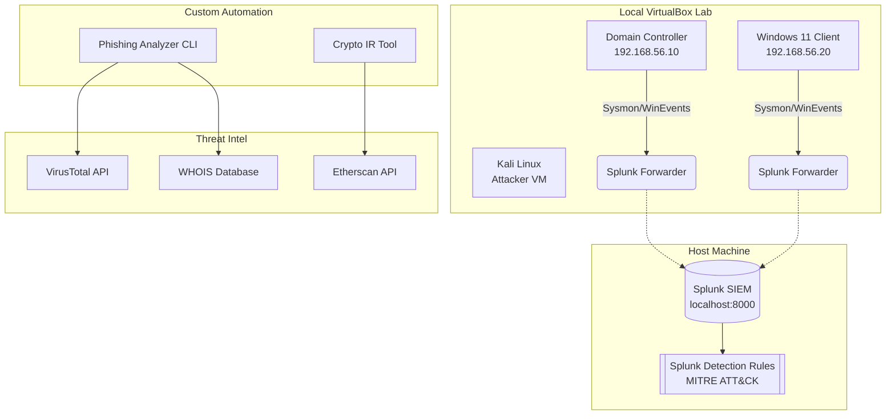

# Randall's Cybersecurity Portfolio

> **Objective:** Transitioning into a Cybersecurity/SOC Analyst role, leveraging a background in automation and software development to build robust defense mechanisms and streamline incident response.

This repository serves as a functional portfolio demonstrating practical, hands-on skills across four core domains of cybersecurity: Infrastructure-as-Code (IaC), Detection Engineering, Threat Intelligence, and Incident Response (IR).

Rather than relying purely on theoretical knowledge, the tools and configurations in this repository were built to solve real-world problems in a custom-built Active Directory home lab environment.

---

## 🏗️ Portfolio Architecture

The following Mermaid diagram outlines the interconnected nature of the tools within this portfolio. A local Active Directory lab feeds telemetry into a SIEM, while custom Python tools act as external response mechanisms.

---

## 🛠️ Projects & Skills Demonstrated

### 1. [Active Directory Lab Automation](./AD-Lab-Automation)
PowerShell scripts designed to rapidly deploy a Windows Server 2022 AD environment, configure GPOs, populate users/OUs, and install Sysmon and Splunk Universal Forwarders.
* **Skills Demonstrated:** 
  * Infrastructure-as-Code (IaC)
  * Active Directory Administration (OUs, GPOs, Users)
  * Endpoint Telemetry (Sysmon SwiftOnSecurity config)
  * Log Aggregation Routing
* 📝 *[Read the Blog Post (Coming Soon)](#)*

### 2. [Splunk Detection Rules](./Splunk-Detection-Rules)
A library of Search Processing Language (SPL) queries mapped to MITRE ATT&CK, designed to detect common post-exploitation activities via Sysmon and Windows Event Logs.
* **Skills Demonstrated:** 
  * Detection Engineering
  * SIEM Querying (Splunk SPL)
  * MITRE ATT&CK Framework mapping
  * Identifying Pass-the-Hash, Kerberoasting, and LotL (PowerShell) attacks
* 📝 *[Read the Blog Post (Coming Soon)](#)*

### 3. [Phishing Analysis Toolkit](./Phishing-Analyzer)
A Python CLI tool that automates the triage of suspicious emails. It parses raw `.eml` files, extracts headers/IPs/URLs, and checks them against WHOIS databases and the VirusTotal API.
* **Skills Demonstrated:** 
  * SOC Automation (Tier 1/2 Triage)
  * Email Header Analysis (SPF, DKIM, DMARC)
  * Threat Intelligence API Integration (VirusTotal)
  * Indicator of Compromise (IoC) extraction via Regex
* 📝 *[Read the Blog Post (Coming Soon)](#)*

### 4. [Crypto Incident Response Tool](./Crypto-IR-Tool)
An MVP Python script utilizing the Etherscan API to analyze Ethereum wallets for indicators of compromise, specifically unauthorized token approvals to unverified smart contracts (Ice Phishing).
* **Skills Demonstrated:** 
  * Web3 / Blockchain Incident Response
  * REST API Data parsing (JSON)
  * Heuristic Threat Modeling
  * Automated Report Generation
* 📝 *[Read the Blog Post (Coming Soon)](#)*

---

## 🚀 Usage & Setup
Each sub-directory contains its own `README.md` with specific installation instructions, prerequisites, and execution commands. 

*Note: All API keys must be provided locally via `.env` files. Reference the provided `.env.example` files in each project directory.*
